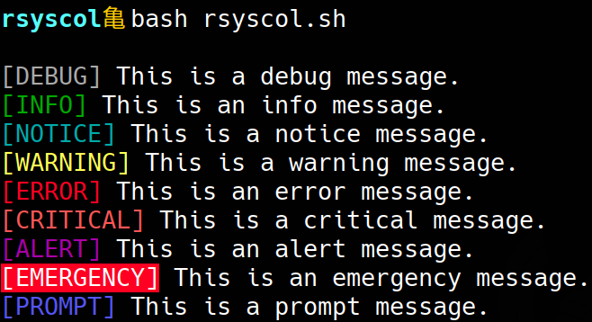

# rsyscol - Colorized Logging for Bash

## Overview
`rsyscol` is a lightweight Bash script that provides **color-coded logging levels**, inspired by `rsyslog`. It helps enhance the visibility of log messages in terminal scripts.

## Features
✅ Supports the **7 standard rsyslog levels**:
- `DEBUG` (Gray)
- `INFO` (Green)
- `NOTICE` (Cyan)
- `WARNING` (Orange)
- `ERROR` (Red)
- `CRITICAL` (Bright Red)
- `ALERT` (Magenta)
- `EMERGENCY` (White on Red Background)

✅ Adds a new **PROMPT level** (Light Blue) for user interactions.  
✅ Simple **`log` function** for easy integration into scripts.  
✅ Compatible with **any Bash script** via `source log.sh`.  

---

## Installation
Clone the repository and source the script:
```bash
git clone https://github.com/yourusername/rsyscol.git
cd rsyscol
source log.sh
```

Alternatively, you can copy `log.sh` into your project and source it:
```bash
cp log.sh /your/project/directory/
```

---

## Usage
### Basic Logging
```bash
source log.sh
log INFO "This is an info message."
log WARNING "This is a warning!"
log ERROR "Something went wrong!"
log PROMPT "Please enter your name:"
```

### Example Output:
```
[INFO] This is an info message.
[WARNING] This is a warning!
[ERROR] Something went wrong!
[PROMPT] Please enter your name:
```
or in color:


### Using in Scripts
Include `source log.sh` at the beginning of your script:
```bash
#!/bin/bash
source log.sh
log DEBUG "This is a debug message."
log CRITICAL "Critical failure detected!"
```

---

## Contributing
Feel free to fork this project and submit pull requests with improvements.

---

## License
`rsyscol` is licensed under the MIT License.

